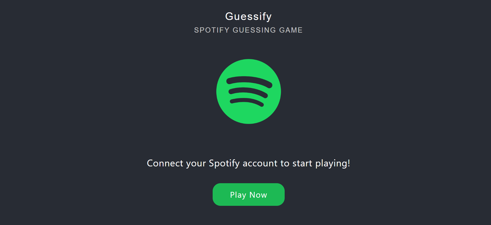
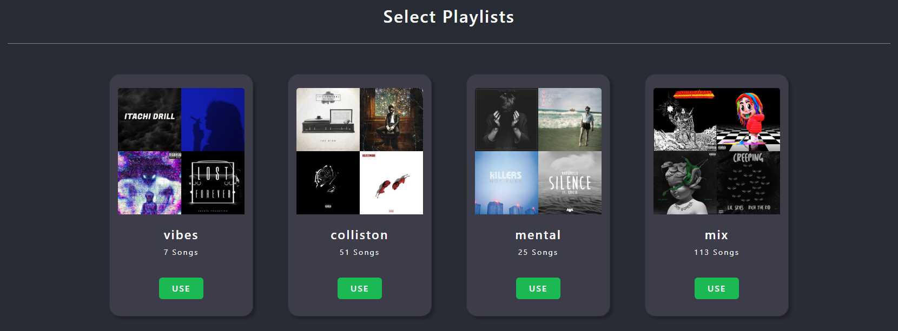
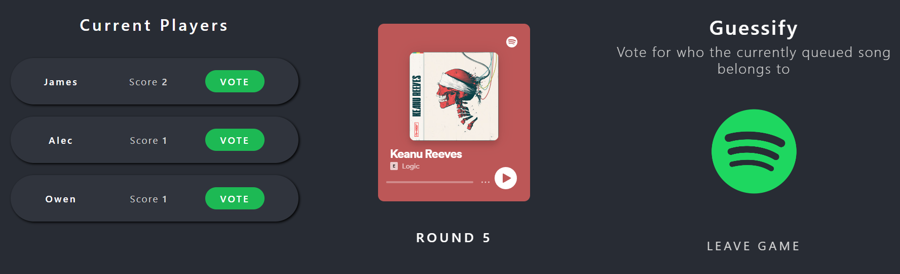
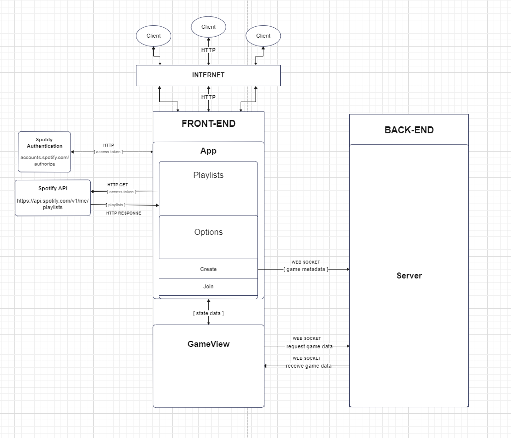

<p align="center"></p>
<p align="center"></p>
<p align="center">Authors: James Guiden, Alec Montesano, Owen Conlon</p>

# Introduction
Guessify is a web-based game application built with React and NodeJS. Users can connect and play with their Spotify accounts by logging in and selecting a playlist to use. They can then choose to create or join a new game where they play through various rounds with other users while guessing whose playlist the currently queued song belongs to. Players are assigned points based on correct guesses with a leaderboard displaying the winner when an endgame state has been triggered.

Interfacing with Spotify's services and API allows for optimal user experience and ease of access.

## Images
<p>Below are some images of various screens within the game.</p>
<p align="center">Splash Screen</p>
<p align="center"></p>
<p align="center">Playlist Selection</p>
<p align="center"></p>
<p align="center">Game View</p>
<p align="center"></p>

# System Architecture
This system utilizes the client-server architecture model. In this model, the client or user typically initiates communication with the server by sending a request for a resource or service. The server then processes the request and sends the requested resource back to the client-side. This model provides a number of benefits, including improved scalability, easier maintenance and management, and enhanced security.

The following diagram demonstrates this architecture flow while depicting the front-end's nested React component nature. Conditional rendering is utilized within the front-end subcomponents to control UI flow, with each component providing a certain function whether that being communication with an API or collecting data to send as props.

<p align="center">Overall Diagram</p>
<p align="center">
    
</p>


# Installation
Proper installation instructions will be provided in the respective client and server directory README files. 

# License
```
MIT License

Copyright (c) 2023 James Guiden

Permission is hereby granted, free of charge, to any person obtaining a copy
of this software and associated documentation files (the "Software"), to deal
in the Software without restriction, including without limitation the rights
to use, copy, modify, merge, publish, distribute, sublicense, and/or sell
copies of the Software, and to permit persons to whom the Software is
furnished to do so, subject to the following conditions:

The above copyright notice and this permission notice shall be included in all
copies or substantial portions of the Software.

THE SOFTWARE IS PROVIDED "AS IS", WITHOUT WARRANTY OF ANY KIND, EXPRESS OR
IMPLIED, INCLUDING BUT NOT LIMITED TO THE WARRANTIES OF MERCHANTABILITY,
FITNESS FOR A PARTICULAR PURPOSE AND NONINFRINGEMENT. IN NO EVENT SHALL THE
AUTHORS OR COPYRIGHT HOLDERS BE LIABLE FOR ANY CLAIM, DAMAGES OR OTHER
LIABILITY, WHETHER IN AN ACTION OF CONTRACT, TORT OR OTHERWISE, ARISING FROM,
OUT OF OR IN CONNECTION WITH THE SOFTWARE OR THE USE OR OTHER DEALINGS IN THE
SOFTWARE.
```

# References
https://developer.spotify.com/documentation/web-api/

https://legacy.reactjs.org/docs/getting-started.html

https://nodejs.org/en/docs

https://getbootstrap.com/docs/5.3/getting-started/introduction/

https://socket.io/docs/v4/

https://oauth.net/2/

https://axios-http.com/docs/intro
